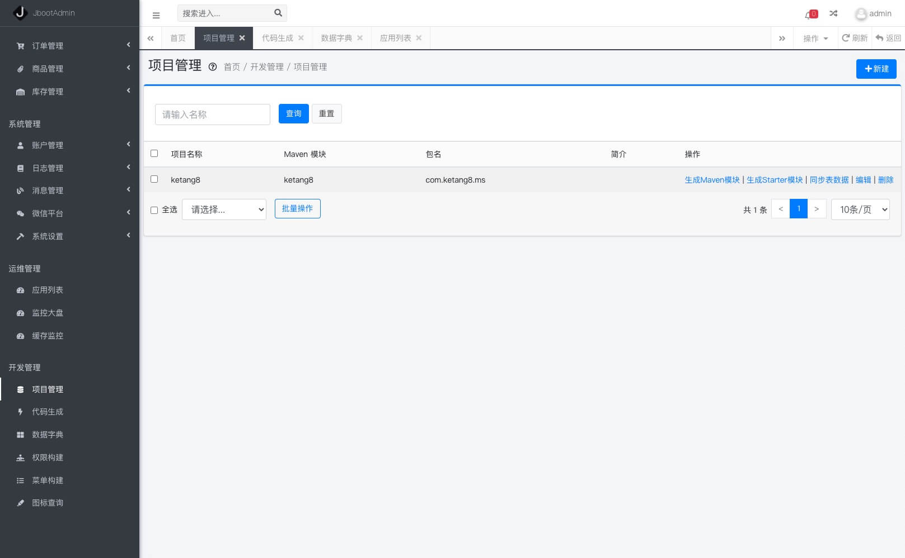

Jboot 是一个基于 JFinal、Dubbo、Seata、Sentinel、ShardingSphere、Nacos 等开发的国产框架。

其特点是：

- 1、基于 JFinal 完整的 MVC + ORM 支持。
- 2、支持多数据源、分库分表和分布式事务。
- 3、支持 Dubbo RPC 的完整功能，有超过 1亿+ 用户产品正在使用。
- 4、完整的单点限流和分布式限流功能
- 5、支持基基于 Apollo 和 Nacos 的分布式配置中心
- 6、完整的分布式缓存、分布式session、分布式附件支持
- 7、内置功能强劲的门户网关
- 8、完整的单元测试支持
- 9、完善代码生成工具 和 API 文档生成工具
- 10、Docker、K8S 友好


## 开始

**maven 依赖**

```xml
<dependency>
    <groupId>io.jboot</groupId>
    <artifactId>jboot</artifactId>
    <version>4.1.6</version>
</dependency>
```

**Hello World**

```java
@RequestMapping("/")
public class Helloworld extends JbootController {

    public void index(){
        renderText("hello world");
    }

    public static void main(String[] args){
        JbootApplication.run(args);
    }
}
```


## 帮助文档

- 文档请访问：[www.jboot.com.cn](http://www.jboot.com.cn)
- Demos 请访问：[这里](./src/test/java/io/jboot/test)

## 广告

- 一个好用的在线代码格式化工具：[http://www.CodeFormat.CN](http://www.codeformat.cn)

## 微信交流群


## JbootAdmin 

JbootAdmin 是 Jboot 官方推出的、收费的、企业级快速开发框架，真诚的为各位开发者提供一站式、保姆式的开发服务。
关于 JbootAdmin 的更多的功能请咨询海哥（微信：wx198819880），或请访问以下网址：

[http://jboot.io/jbootadmin/feature.html](http://jboot.io/jbootadmin/feature.html)





