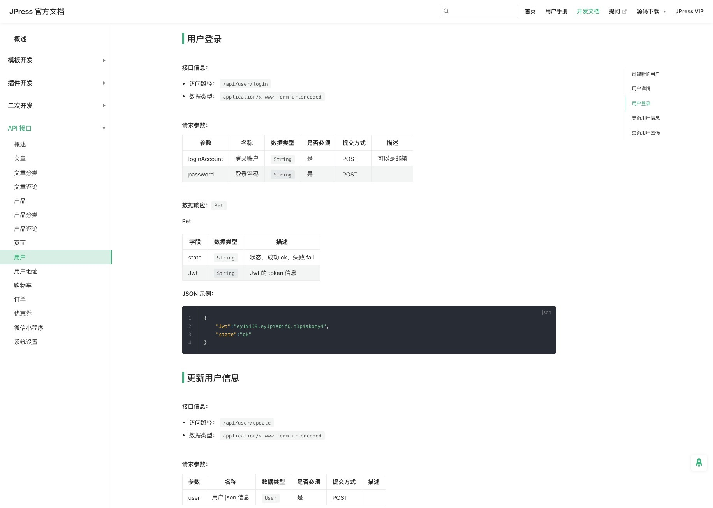

# Jboot API 文档生成

在 Jboot 中内置了 4 个注解，用于生成帮助开发者生成 API 文档。它们分别是

- @Api  ：给 Controller 配置，一个 Controller 生成一个文档文件。
- @ApiOper ：给 Controller 的方法配置。
- @ApiPara ：给 Controller 的参数进行配置。
- @ApiResp ：给 Controller 的 Render 内容进行配置。

## 基本使用

生成文档的过程，需要自己写一个 `main()` 方法，然后通过 ApiDocManager 来生成，代码如下：

```java
public class ApiDocGenerator {

    public static void main(String[] args) {

        ApiDocConfig config = new ApiDocConfig();
        config.setBasePath("./doc/api");

        ApiDocManager.me().genDocs(config);
    }
}
```

Controller 代码如下：

```java
@RequestMapping("/api/user")
@Api("用户相关API")
public class UserApiController extends ApiControllerBase {

    @Inject
    private UserService userService;


    @ApiOper("用户登录")
    @ApiResp(field="Jwt",notes="Jwt 的 Token 信息")
    public Ret login(
              @ApiPara(value = "登录账户", notes = "可以是邮箱") @NotNull String loginAccount
            , @ApiPara("登录密码") @NotNull String password) {
        //....
        return Ret.ok().set("Jwt","....");
    }


    @ApiOper("用户详情")
    public Ret detail(@ApiPara("用户ID") @NotNull Long id) {
        //....
    }


    @ApiOper("更新用户信息")
    public Ret update(@ApiPara("用户 json 信息") @JsonBody @NotNull User user) {
        //....
    }
}    
```

默认情况下，` ApiDocManager.me().genDocs(config)` 生成的是 Markdown 文档，内容如下：



## 不同的文档生成在不同的目录

一般情况下，如下的代码会去找到所有带有 `@Api` 注解的 `Controller` 生成文档，并生成在同一个目录：

```java
public class ApiDocGenerator {

    public static void main(String[] args) {

        ApiDocConfig config = new ApiDocConfig();
        config.setBasePath("./doc/api");

        ApiDocManager.me().genDocs(config);
    }
}
```

不同的 `Controller` 生成在不同的目录，代码如下：

```java
public class ApiDocGenerator {

    public static void main(String[] args) {

        ApiDocConfig config1 = new ApiDocConfig();
        config1.setBasePath("./doc/api1");
        config1.setPackagePrefix("com.xxx.package1");

        ApiDocManager.me().genDocs(config1);


        ApiDocConfig config2 = new ApiDocConfig();
        config2.setBasePath("./doc/api2");
        config2.setPackagePrefix("com.xxx.package2");

        ApiDocManager.me().genDocs(config2);
    }
}
```

## 多个 `Controller` 生成一个文档

`@Api` 注解提供了一个 `collect` 的配置，用于汇总其他 `Controller` 的接口。 例如：

```java
@RequestMapping("/api/user")
@Api(value="用户相关API",collect={Controler1.class, Controller2.class})
public class UserApiController extends ApiControllerBase {

    
    @ApiOper("用户登录")
    public Ret login(@ApiPara(value = "登录账户", notes = "可以是邮箱") @NotNull String loginAccount
            , @ApiPara("登录密码") @NotNull String password) {
        //....
    }


}    
```

`@Api(value="用户相关API",collect={Controler1.class,Controller2.class})` 表示 `UserApiController` 生成
的文档会把 `Controler1` 和  `Controller2` 的接口也汇总到此文档里来。

> 注意：此时，`Controler1` 和  `Controller2` 不再需要添加 `@Api` 注解。

## 所有的 API 生成在 1 文档里

```java
public class ApiDocGenerator {

    public static void main(String[] args) {

        ApiDocConfig config = new ApiDocConfig();
        config.setBasePath("./doc/api");
        
        //所有的 api 信息生成在同一个文档里
        config.setAllInOneEnable(true);

        ApiDocManager.me().genDocs(config);
    }
}
```


## 无参数的 Action 生成 API 文档
在 Jboot 和 JFinal 中，有很多 Controller 的方法可能不是带有参数的，而是通过 `getPara()` 等方法来获取参数。

```java
@RequestMapping("/api/user")
@Api(value="用户相关API")
public class UserApiController extends ApiControllerBase {

    public Ret login() {
        String loginName = getPara("loginName");
        String password = getPara("password");
        
        //....
    }
}    
```

我们可以使用 `@ApiParas` 注解，代码如下：

```java
import io.jboot.apidoc.annotation.ApiPara;
import io.jboot.apidoc.annotation.ApiParas;

@RequestMapping("/api/user")
@Api(value = "用户相关API")
public class UserApiController extends ApiControllerBase {


    @ApiParas({
            @ApiPara(value="登录名",name="loginName"),
            @ApiPara(value="密码",name="password"),
    })
    public Ret login() {
        String loginName = getPara("loginName");
        String password = getPara("password");

        //....
    }
}    
```

## 生成 word、html 或更多...

默认情况下，在如下的代码中，`ApiDocManager` 生成的是 Markdown 文档。

```java
public class ApiDocGenerator {

    public static void main(String[] args) {

        ApiDocConfig config = new ApiDocConfig();
        config.setBasePath("./doc/api");

        ApiDocManager.me().genDocs(config);
    }
}
```


如果我们需要生成 word、html 等其他文档，需要自定义 `ApiDocRender` ，并配置给 `ApiDocManager`。

```java
public class MyApiDocRender extends ApiDocRender {

    void render(List<ApiDocument> apiDocuments, ApiDocConfig config){
        //自定义渲染，生成 html 或者 word 等等...
    }

}
```

配置 `MyApiDocRender` 并开始生成文档。

```java
public class ApiDocGenerator {

    public static void main(String[] args) {

        ApiDocConfig config = new ApiDocConfig();
        config.setBasePath("./doc/api");

        ApiDocManager.me().setRender(new MyApiDocRender());
        ApiDocManager.me().genDocs(config);
    }
}
```