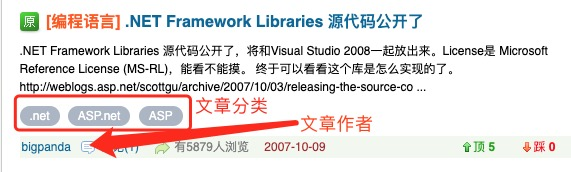

# 数据库

Jboot 数据库功能基于 JFinal 的 ActiveRecordPlugin 插件和 Apache sharding-sphere 框架，提供了方便快捷的数据库操作能力。

## 目录

- 描述
- 基本增删改查
    - Db + Record 模式
    - Model 映射方式
    - Columns 查询方式
- 关联查询
- 分页查询
- 一对一、一对多、多对一、多对对
- 事务操作
- 多数据源
- 读写分离
- 分库分表
- 分布式事务

## 描述

Jboot 的数据库是依赖 JFinal 的 ORM 做基本的数据库操作，同时依赖 apahce-sphere 来做分库、分表和依赖 Seata 来做分布式事务。因此，在使用 Jboot 操作数据库的时候，建议对 JFinal 的 ORM 功能和 Apache Sharding-Sphere 有所了解。

- JFinal的数据库操作相关文档：https://www.jfinal.com/doc/5-1
- Apache Sharding-Sphere 文档：http://shardingsphere.io/document/current/cn/overview/
- Seata 的帮助文档：https://github.com/seata/seata/wiki/Home_Chinese


## 基本增删改查

JFinal 操作数据库，提供了两种方式对数据库进行操作，他们分别是：
- Db + Record 方式
- Model 映射方式

### Db + Record 方式


参考 JFinal 的文档：https://jfinal.com/doc/5-5


### Model 映射方式

Model是 MVC 模式中的 M 部分。以下是 Model 定义示例代码：

```java
@Table(tableName = "user", primaryKey = "id")
public class User extends BaseUser<User> {

}   
```

BaseUser：

```java
public abstract class BaseUser<M extends BaseUser<M>> extends JbootModel<M> implements IBean {

	public void setId(java.lang.Long id) {
		set("id", id);
	}
	
	public java.lang.Long getId() {
		return getLong("id");
	}

	// other getter setter ...

}
```

需要注意的是：
- 以上的 `User` 和 `BaseUser` 都是通过代码生成器自动生成的，无需手写。
- 多次执行代码生成器，`User` 代码不会被覆盖，但是 `BaseUser` 会被重新覆盖，因此，请不要在 `BaseUser` 手写任何代码。

一般情况下，在正式的项目里，代码分层还需要 `Service` 层来对业务逻辑进行处理。

UserService 代码如下:

```java
public class UserService extends JbootServiceBase<User>  {

    // 不需要做任何的实现
    
}  
```

以上的 `UserService` , 只需要继承 `JbootServiceBase<User>` ,我们不需要编写任何实现代码，就可以拥有基本的增删改查的功能。

以下是示例代码：

```java
//创建 UserService
UserService userService = new UserService();

// 创建name属性为James,age属性为25的User对象并添加到数据库
User user = new User().set("name", "James").set("age", 25);
userService.save(user); 

// 删除id值为25的User
userService.deleteById(25);
 
// 查询id值为25的User将其name属性改为James并更新到数据库
User user = userService.findById(25);
user.set("name", "James");
userService.update(user);
 
// 分页查询user,当前页号为1,每页10个user
Page<User> userPage = userService.paginate(1, 10);
```


### Columns 查询

在 JFinal 的基础上上，Jboot 提供了一套更加便利的查询方法，根据列查询。

比如，一个 `tb_user` 表中有以下字段：

```sql
CREATE TABLE `user` (
  `id` int(11) unsigned NOT NULL AUTO_INCREMENT COMMENT '主键ID',
  `username` varchar(128) DEFAULT NULL COMMENT '登录名',
  `nickname` varchar(128) DEFAULT NULL COMMENT '昵称',
  `realname` varchar(128) DEFAULT NULL COMMENT '实名',
  `email` varchar(64) DEFAULT NULL COMMENT '邮件',
  `mobile` varchar(32) DEFAULT NULL COMMENT '手机电话',
  `gender` varchar(16) DEFAULT NULL COMMENT '性别',
  `signature` varchar(2048) DEFAULT NULL COMMENT '签名',
  `birthday` datetime DEFAULT NULL COMMENT '生日',
  `company` varchar(256) DEFAULT NULL COMMENT '公司',
  `occupation` varchar(256) DEFAULT NULL COMMENT '职位、职业',
  `address` varchar(256) DEFAULT NULL COMMENT '地址',
  `zipcode` varchar(128) DEFAULT NULL COMMENT '邮政编码',
  `site` varchar(256) DEFAULT NULL COMMENT '个人网址',
  `graduateschool` varchar(256) DEFAULT NULL COMMENT '毕业学校',
  `education` varchar(256) DEFAULT NULL COMMENT '学历',
  `avatar` varchar(256) DEFAULT NULL COMMENT '头像',
  `idcardtype` varchar(128) DEFAULT NULL COMMENT '证件类型：身份证 护照 军官证等',
  `idcard` varchar(128) DEFAULT NULL COMMENT '证件号码',
  PRIMARY KEY (`id`)
) ENGINE=InnoDB DEFAULT CHARSET=utf8mb4 COMMENT='用户信息表，保存用户信息。';
```

假设我们根据 `username` 查询，可以如下：

```java
String name = "michael";
DAO.findFirstByColumns(Columns.create("username",name));
```

当有关联查询的时候，可以使用 DAO 的 join 系列方法，如下：

```java
/**
*查询所有用户，left join 文章表
*/
public List<User> findList(){
   DAO.leftJoin("article").on("user.id = article.user_id")
      .rightJoin("...").on(".....")
      .findAll()
}

/**
* 根据用户年龄和文章标题查询
*/
public List<User> findListBy(int userAge,String articleTitle){
   DAO.leftJoin("article").on("user.id = article.user_id")
      .rightJoin("...").on(".....")
      .findByColumns(Columns.create().ge("user.age",userAge).like("article.title",articleTitle))
}
```


## 一对一、一对多、多对一、多对对

在 Jboot 中，提供了 Join 系列方法，我们在 Service 层可以直接使用 Join 进行 一对一、一对多、多对一、多对对 的查询操作。


假设存在这样的关系：一篇文章只有一个作者，一个作者可以写多篇文章，一篇文章可以归属多个文章分类、一个文章分类有可以包含多篇文章。


那么，表结构设计如下：


文章表 article :

```sql
CREATE TABLE `article` (
  `id` int(11) unsigned NOT NULL AUTO_INCREMENT COMMENT '主键ID',
  `title` varchar(128) DEFAULT NULL COMMENT '文章标题',
  `author_id` int(11) unsigned NOT NULL COMMENT '文章作者ID',
  `content` varchar(128) DEFAULT NULL COMMENT '文章内容',
  PRIMARY KEY (`id`)
) ENGINE=InnoDB DEFAULT CHARSET=utf8mb4 COMMENT='文章信息表';
```


文章作者表 author ：

```sql
CREATE TABLE `author` (
  `id` int(11) unsigned NOT NULL AUTO_INCREMENT COMMENT '主键ID',
  `username` varchar(128) DEFAULT NULL COMMENT '作者名称',
  PRIMARY KEY (`id`)
) ENGINE=InnoDB DEFAULT CHARSET=utf8mb4 COMMENT='文章作者表';
```


文章分类表 category ：

```sql
CREATE TABLE `category` (
  `id` int(11) unsigned NOT NULL AUTO_INCREMENT COMMENT '主键ID',
  `title` varchar(128) DEFAULT NULL COMMENT '文章分类名称',
  `description` varchar(128) DEFAULT NULL COMMENT '文章分类描述',
  PRIMARY KEY (`id`)
) ENGINE=InnoDB DEFAULT CHARSET=utf8mb4 COMMENT='文章分类表';
```


文章分类和分类的 多对对关系表： article_category_mapping ：

```sql
CREATE TABLE `article_category` (
  `article_id` int(11) unsigned NOT NULL COMMENT '主键ID',
  `category_id` int(11) unsigned NOT NULL COMMENT '文章分类名称',
) ENGINE=InnoDB DEFAULT CHARSET=utf8mb4 COMMENT='文章分类和分类的 多对对关系表';
```


这样，在我们的代码里应该存在 3 个Service，分别是：

- ArticleService 用于查询文章相关的服务
- CategoryService 用于查询文章分类相关的服务
- AuthorService 用于查询作者的服务


当在一个网页中显示文字列表，文章列表里，及包含了作者信息，也包含了多个分类，如下图所示：




那么，查询代码如下（伪代码）：


```java
//分页查询所有的文章
Page<Article> articlePage = articleService.paginate(...);

//查询文章的作者
authorService.join(articlePage,"author_id");

//查询文章的分类
categoryService.joinManyByTable(articlePage,"article_category","article_id","category_id")

```


如果，在某些场景下，我们要查询作者，以及作者下的文章列表，代码如下：

```java
//分页查询出作者信息
Page<Author> authorPage = arthorService.paginate(...);

articleService.joinMany(authorPage,"author_id");
```


具体代码参考：[这里](../../../src/test/java/io/jboot/test/join)


## 多数据源

默认单数据源的情况下，我们需要在 `jboot.properties` 添加如下配置：

```
jboot.datasource.type=mysql
jboot.datasource.url=jdbc:mysql://127.0.0.1:3306/jbootdemo
jboot.datasource.user=root
jboot.datasource.password=your_password
```

如果是多个数据源，我们可以在 `jboot.datasource.` 后面添加数据源的名称，例如：

```
jboot.datasource.a1.type=mysql
jboot.datasource.a1.url=jdbc:mysql://127.0.0.1:3306/jboot1
jboot.datasource.a1.user=root
jboot.datasource.a1.password=your_password

jboot.datasource.a2.type=mysql
jboot.datasource.a2.url=jdbc:mysql://127.0.0.1:3306/jboot2
jboot.datasource.a2.user=root
jboot.datasource.a2.password=your_password
```

这表示，我们又增加了数据源 `a1` 和数据源 `a2`，在使用的时候，我们只需要做一下使用：

```java
Company company = new Company();
company.setCid("1");
company.setName("name");

company.use("a1").save();
```

`company.use("a1").save();` 表示使用数据源 `a1` 进行保存。


**需要注意的是：**

在多数据源应用中，很多时候，我们的一个 Model 只有对应一个数据源，而不是一个 Model 对应多个数据源。假设 `company` 只有在 `a1` 数据源中存在，在其他数据源并不存在，我们需要把 `a1` 数据源的配置修改如下：

```
jboot.datasource.a1.type=mysql
jboot.datasource.a1.url=jdbc:mysql://127.0.0.1:3306/jboot1
jboot.datasource.a1.user=root
jboot.datasource.a1.password=your_password
jboot.datasource.a1.table=company

jboot.datasource.a2.type=mysql
jboot.datasource.a2.url=jdbc:mysql://127.0.0.1:3306/jboot2
jboot.datasource.a2.user=root
jboot.datasource.a2.password=your_password
jboot.datasource.a2.table=user,xxx (其他非company表)
```

这样，`company` 在 `a1` 数据源中存在，Jboot在初始化的时候，并不会去检查 `company` 在其他数据源中是否存在，同时，代码操作 `company` 的时候，不再需要 `use()` ，代码如下：


```java
Company company = new Company();
company.setCid("1");
company.setName("name");

//company.use("a1").save();
company.save();
```

代码中不再需要 `use("a1")` 指定数据源，因为 `company` 表只有一个数据源。

更多关于 datasource 的配置如下：

```
jboot.datasource.name  //数据源名称
jboot.datasource.type  //数据源类型
jboot.datasource.url   //数据源URL地址
jboot.datasource.user  
jboot.datasource.password
jboot.datasource.driverClassName = com.mysql.jdbc.Driver
jboot.datasource.connectionInitSql
jboot.datasource.poolName
jboot.datasource.cachePrepStmts = true
jboot.datasource.prepStmtCacheSize = 500
jboot.datasource.prepStmtCacheSqlLimit = 2048
jboot.datasource.maximumPoolSize = 10
jboot.datasource.maxLifetime
jboot.datasource.idleTimeout
jboot.datasource.minimumIdle = 0
jboot.datasource.sqlTemplatePath // sql 模板存放路径，用到 jfinal sql独立文件的时候
jboot.datasource.sqlTemplate 
jboot.datasource.factory
jboot.datasource.shardingConfigYaml //分库分表的配置文件
jboot.datasource.dbProFactory
jboot.datasource.containerFactory
jboot.datasource.transactionLevel
jboot.datasource.table //此数据源包含哪些表
jboot.datasource.exTable //该数据源排除哪些表
jboot.datasource.dialectClass
jboot.datasource.activeRecordPluginClass
jboot.datasource.needAddMapping = true //是否需要添加到映射，当不添加映射的时候，只能通过 model.use("xxx").save()这种方式去调用该数据源
```


## 读写分离

在 Jboot 应用中，读写分离建议使用两个数据源，分别是读的数据源和写的数据源，写的数据源必须支持可读可写。

在应用中，在某些场景下我们需要从只读数据源读取数据的时候，通过 `DAO.use('只读数据源的名称').find(...)` 就可以。

## 分库分表

Jboot 的分库分表功能使用了 Sharding-jdbc 实现的，若在 Jboot 应用在需要用到分库分表功能，需要添加 `jboot.datasource.shardingConfigYaml = xxx.yaml ` 的配置，其中 `xxx.yaml` 配置需要放在 classpath 目录下，配置内容参考：https://shardingsphere.apache.org/document/current/cn/manual/sharding-jdbc/configuration/config-yaml/

**注意：** 当在 `jboot.properties` 文件配置 `jboot.datasource.shardingConfigYaml = xxx.yaml`之后，不再需要在 `jboot.properties` 配置 `jboot.datasource.url` 、 `jboot.datasource.user` 和 `jboot.datasource.password` 等，这些配置都转义到 `xxx.yaml` 里进行配置了。

## 分布式事务

Jboot 的分布式事务依赖 Seata 来进行实现，在开始分布式事务之前，请先做好 Seata 的相关配置。

- 创建 Seata 数据库
- 启动 Seata

参考：https://github.com/seata/seata/wiki/Quick-Start

正常启动 Seata 之后，需要在 jboot.properties 配置文件添加如下配置

```
jboot.rpc.filter = seata
jboot.rpc.type = dubbo
jboot.seata.enable = true
jboot.seata.failureHandler = com.alibaba.io.seata.tm.api.DefaultFailureHandlerImpl
jboot.seata.applicationId = Dubbo_Seata_Account_Service
jboot.seata.txServiceGroup = dubbo_seata_tx_group
```
同时，在 resource 目录下添加 `registry.conf` 文件，用于对 seata 进行 registry 配置，内容如下：

```
registry {
  # file 、nacos 、eureka、redis、zk、consul、etcd3、sofa
  type = "file"

  nacos {
    serverAddr = "localhost"
    namespace = ""
    cluster = "default"
  }
  eureka {
    serviceUrl = "http://localhost:8761/eureka"
    application = "default"
    weight = "1"
  }
  redis {
    serverAddr = "localhost:6379"
    db = "0"
  }
  zk {
    cluster = "default"
    serverAddr = "127.0.0.1:2181"
    session.timeout = 6000
    connect.timeout = 2000
  }
  consul {
    cluster = "default"
    serverAddr = "127.0.0.1:8500"
  }
  etcd3 {
    cluster = "default"
    serverAddr = "http://localhost:2379"
  }
  sofa {
    serverAddr = "127.0.0.1:9603"
    application = "default"
    region = "DEFAULT_ZONE"
    datacenter = "DefaultDataCenter"
    cluster = "default"
    group = "SEATA_GROUP"
    addressWaitTime = "3000"
  }
  file {
    name = "file.conf"
  }
}

config {
  # file、nacos 、apollo、zk、consul、etcd3
  type = "file"

  nacos {
    serverAddr = "localhost"
    namespace = ""
  }
  consul {
    serverAddr = "127.0.0.1:8500"
  }
  apollo {
    app.id = "seata-server"
    apollo.meta = "http://192.168.1.204:8801"
  }
  zk {
    serverAddr = "127.0.0.1:2181"
    session.timeout = 6000
    connect.timeout = 2000
  }
  etcd3 {
    serverAddr = "http://localhost:2379"
  }
  file {
    name = "file.conf"
  }
}
```

> PS：如果不想叫 registry.conf ,请在环境变量里配置 `seata.config.name = yourname` ，那么可以使用 yourname.conf 代替 registry.conf。


同时，在 resource 目录下添加 file.conf 文件，内容如下：

```
transport {
  # tcp udt unix-domain-socket
  type = "TCP"
  #NIO NATIVE
  server = "NIO"
  #enable heartbeat
  heartbeat = true
  #thread factory for netty
  thread-factory {
    boss-thread-prefix = "NettyBoss"
    worker-thread-prefix = "NettyServerNIOWorker"
    server-executor-thread-prefix = "NettyServerBizHandler"
    share-boss-worker = false
    client-selector-thread-prefix = "NettyClientSelector"
    client-selector-thread-size = 1
    client-worker-thread-prefix = "NettyClientWorkerThread"
    # netty boss thread size,will not be used for UDT
    boss-thread-size = 1
    #auto default pin or 8
    worker-thread-size = 8
  }
  shutdown {
    # when destroy server, wait seconds
    wait = 3
  }
  serialization = "seata"
  compressor = "none"
}
service {
  #vgroup->rgroup
  vgroup_mapping.dubbo_seata_tx_group = "default"
  #only support single node
  default.grouplist = "127.0.0.1:8091"
  #degrade current not support
  enableDegrade = false
  #disable
  disable = false
  #unit ms,s,m,h,d represents milliseconds, seconds, minutes, hours, days, default permanent
  max.commit.retry.timeout = "-1"
  max.rollback.retry.timeout = "-1"
}

client {
  async.commit.buffer.limit = 10000
  lock {
    retry.internal = 10
    retry.times = 30
  }
  report.retry.count = 5
  tm.commit.retry.count = 1
  tm.rollback.retry.count = 1
}

## transaction log store
store {
  ## store mode: file、db
  mode = "file"

  ## file store
  file {
    dir = "sessionStore"

    # branch session size , if exceeded first try compress lockkey, still exceeded throws exceptions
    max-branch-session-size = 16384
    # globe session size , if exceeded throws exceptions
    max-global-session-size = 512
    # file buffer size , if exceeded allocate new buffer
    file-write-buffer-cache-size = 16384
    # when recover batch read size
    session.reload.read_size = 100
    # async, sync
    flush-disk-mode = async
  }

  ## database store
  db {
    ## the implement of javax.sql.DataSource, such as DruidDataSource(druid)/BasicDataSource(dbcp) etc.
    datasource = "dbcp"
    ## mysql/oracle/h2/oceanbase etc.
    db-type = "mysql"
    driver-class-name = "com.mysql.jdbc.Driver"
    url = "jdbc:mysql://127.0.0.1:3306/seata"
    user = "mysql"
    password = "mysql"
    min-conn = 1
    max-conn = 3
    global.table = "global_table"
    branch.table = "branch_table"
    lock-table = "lock_table"
    query-limit = 100
  }
}
lock {
  ## the lock store mode: local、remote
  mode = "remote"

  local {
    ## store locks in user's database
  }

  remote {
    ## store locks in the seata's server
  }
}
recovery {
  #schedule committing retry period in milliseconds
  committing-retry-period = 1000
  #schedule asyn committing retry period in milliseconds
  asyn-committing-retry-period = 1000
  #schedule rollbacking retry period in milliseconds
  rollbacking-retry-period = 1000
  #schedule timeout retry period in milliseconds
  timeout-retry-period = 1000
}

transaction {
  undo.data.validation = true
  undo.log.serialization = "jackson"
  undo.log.save.days = 7
  #schedule delete expired undo_log in milliseconds
  undo.log.delete.period = 86400000
  undo.log.table = "undo_log"
}

## metrics settings
metrics {
  enabled = false
  registry-type = "compact"
  # multi exporters use comma divided
  exporter-list = "prometheus"
  exporter-prometheus-port = 9898
}

support {
  ## spring
  spring {
    # auto proxy the DataSource bean
    datasource.autoproxy = false
  }
}
```

> 注意：
> 1、jboot.seata.txServiceGroup 配置的值要注意和 file.conf 里的 vgroup_mapping.xxx 保持一致
> 2、jboot.rpc.filter=seata ##seata在Dubbo中的事务传播过滤器

以上配置完毕后如何使用呢？点击 [这里](../../src/test/java/io/jboot/test/seata) 查看代码实例。