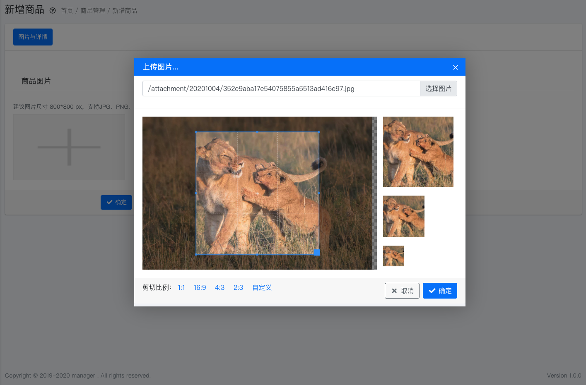

# 前端组件

JbootAdmin 内置了大量的组件，我们几乎不需要编写任何的 JavaScript 代码就可以轻松的使用这些前段组件。

## Layer

Layer 是一个功能强大的弹出层，弹出层里既可以通过一个 Div 来渲染，也可以通过一个 IFrame 来渲染弹出。

示例：

```html
<a href="user.html" open-type="layer"> 示例 </a>
```

当我们点击该 `a` 标签链接时，此链接将以弹窗的方式访问 `user.html` 。若是 `input` 或者 `textarea` 等添加了 `open-type="layer"` 属性，那么当 `input` 或者 `textarea` 获得焦点的时候，会自动打开弹窗 Layer。


在组件中，可以配置的属性如下：


- data-layer-type : 打开 layer 的类型
- data-layer-title : 打开 layer 的标题
- data-layer-anim : 打开 layer 的动画
- data-layer-shade-close
- data-layer-shade
- data-layer-area
- data-layer-content
- data-layer-binds ： layer 关闭后，对数据进行绑定
- data-layer-end : 当 layer 关闭后，执行的方法

## Switchery 开关


```html
<input class="switchery" type="checkbox">
```

其支持的属性内容如下：

- for:  自动同步 switchery 的值到其他的 input 
- data-ctrl: 用于控制某个 div 显示或隐藏
- data-open-sync ：当此 switchery 开启的时候，自动同步到其他的 switchery 一起开启。
- data-close-sync :  当此 switchery 关闭的时候，自动同步其他的 switchery 一起关闭。
- data-change-function :  当此 switchery 点击开启或者关闭时执行的方法


## 确认操作弹出组件

在很多场景下，在用户要进行某个操作之前，我们需要弹出一个对话框让用户进行确定。比如我们要删除某个数据，我们需要弹出一个确认框让用户确认之后，在进行下一步的删除行动。


```html
<a href="href/to/your/path" open-type="confirm">
```

或者 如下代码用于  删除数据 的弹出确认。

```html
<a href="href/to/your/path" open-type="del-confirm">
```


其支持的属性内容如下：

- data-title : 弹出确认框标题
- data-text: 弹出确认框内容
- data-btn-text: 弹出确认框按钮内容
- data-success-title : 成功弹出标题
- data-success-text: 成功弹出内容
- data-success-function ： ajax 提交数据成功执行的方法
- data-success-goto: ajax 执行数据成功后，跳转到的页面url地址
- data-success-message: ajax 支持成功后，弹出提示内容
- data-fail-function: ajax 提交失败后，执行的 js 方法
- data-fail-message: ajax 提交失败后，弹出的提示内容。


## 链接自动 Ajax 提交

```html
<a href="/href/to/your/path" open-type="ajax">
```

当 `a` 标签有 `open-type="ajax"` 时，我们点击 `a` 标签的时候，自动会自动以 ajax 方式提交到 `/href/to/your/path` ，但是往往我们需要执行完成 ajax 提交后，会执行某些动作，此时需要添加

`data-success-function` 属性。

```html
<a href="/href/to/your/path" open-type="ajax" data-success-function="myfunc">
  
<script>
function myfunc(data){
  //data 为后台返回的 json 数据
  alert('ajax finished!');
}    
</scripts> 

```

其支持的属性内容如下：

- data-success-function ： ajax 提交数据成功执行的方法
- data-success-goto: ajax 执行数据成功后，跳转到的页面url地址
- data-success-message: ajax 支持成功后，弹出提示内容
- data-fail-function: ajax 提交失败后，执行的 js 方法
- data-fail-message: ajax 提交失败后，弹出的提示内容。

## 图片上传组件

JbootAdmin 图片上传组件支持了图片剪切的功能，如下图所示:




上传图片的本质是使用了 layer 组件，当 上传图片 的 layer 弹出被关闭的时候，会自动把 src 只返回来。我们可以使用属性 data-layer-binds 来为其绑定数据。例如：

```html
<a href="/cms/upload/image" open-type="layer"  
data-layer-area="['800px', '600px']" 
data-layer-title="上传图片..." 
data-layer-binds="#input:src">选择图片</a > 
```
调用上传图片组件，调用完成后，自动把图片的地址绑定到 `id='input'` 的组件里去。


```html
<a href="/cms/upload/image" open-type="layer"  
data-layer-area="['800px', '600px']" 
data-layer-title="上传图片..." 
data-layer-end="endFunction">选择图片</a > 
```
调用上传图片组件，调用完成后，自动把自动执行 `endFunction(data)` 这个 js 方法，通过 `data.src` 可以获得图片的 url 地址。 