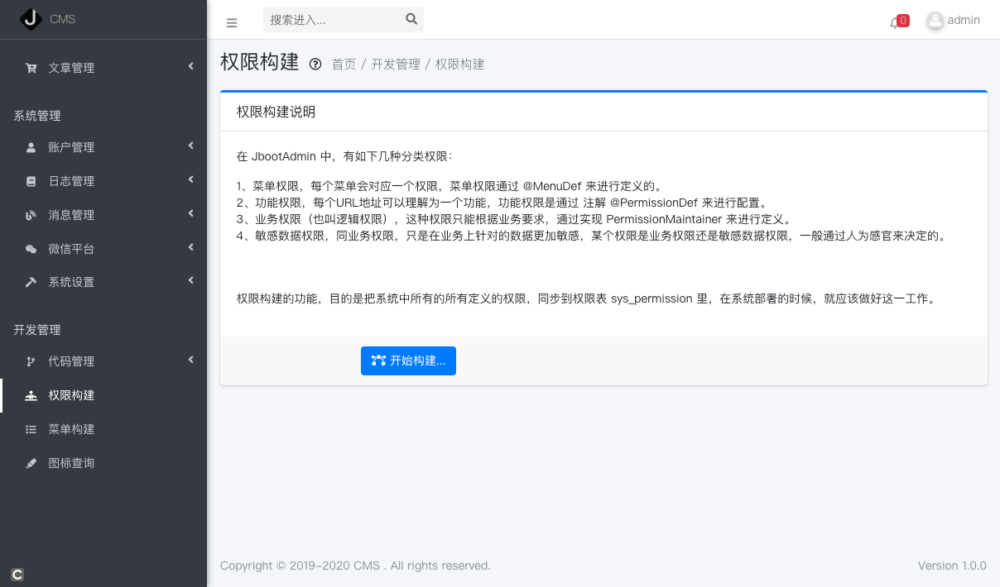
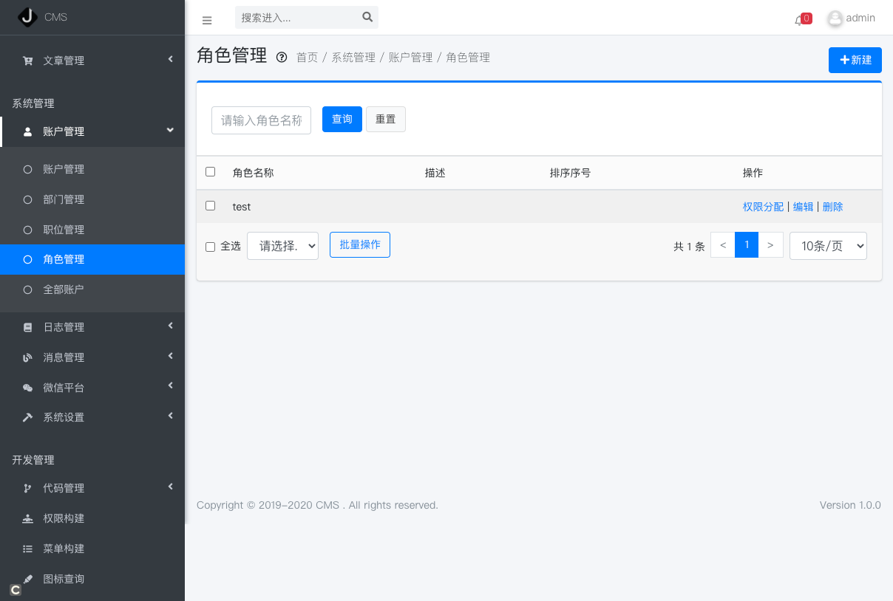
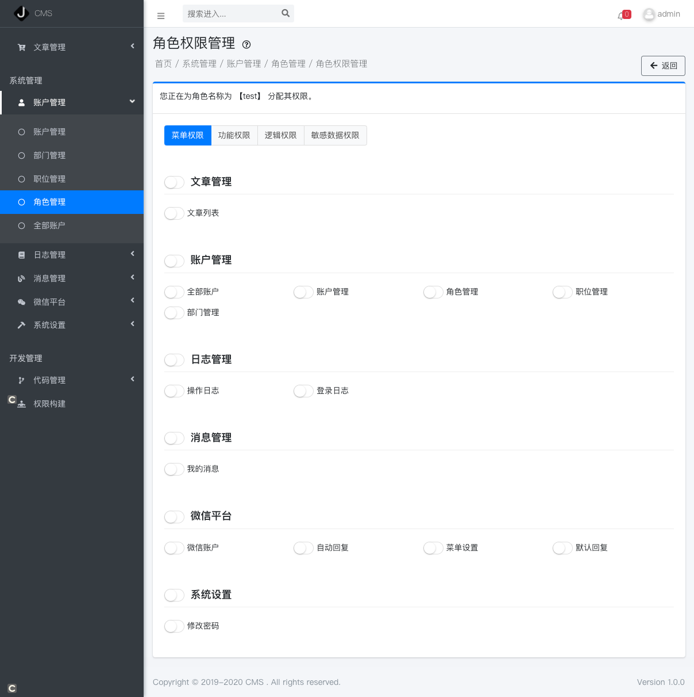

# 权限设计

权限的设计中，包含了两部分，分别是 

- 1）权限的定义
- 2）权限的分配


## 权限的定义

在 JbootAdmin 系统中，我们可以通过两种方式来定义权限，但是，在定义权限之前，我们需要定义一个权限组，每个权限都应该属于一个权限组，这样我们在后台分配权限的时候，可以方便的找到该权限，或者全选某个权限组的所有权限。

### 定义权限组

定义权限组，我们需要写一个权限组的类，并实现 `PermissionGroupBuilder` 接口，这个类在项目启动的时候会被自动加载，只要有这个类的存在即可，代码如下：

```java
public class AdminPermissionGroups implements PermissionGroupBuilder {

    public static final String ACCOUNT = "framework:account";
  
    static List<PermissionGroupBean> permissionGroups = new ArrayList<>();
    static {
        permissionGroups.add(new PermissionGroupBean(ACCOUNT, "账户管理", null, PermissionTypes.ACTION, 111));
    }


    @Override
    public List<PermissionGroupBean> buildPermissionGroups() {
        return permissionGroups;
    }
}
```

这个代码定义了一个权限组，名称为 “账户管理”，ID 为 `framework:account` 。

### 定义权限

权限的定义分为两种方式：

- 1） 通过编码实现 `PermissionBuilder` 接口
- 2） 通过注解 `@PermissionDef` 给 Action 进行定义

**通过编码进行定义权限**

和权限组的定义类似，权限的定义也可以通过实现 `PermissionBuilder` 接口，并复写其方法 `buildPermissions()` 来实现，例如：

  ```java
  public class PortalPermissions implements PermissionBuilder {
  
  
      static List<PermissionBean> portalPermissions = new ArrayList<>();
      static {
  //        portalPermissions.add() 添加手动维护的权限
      }
  
      @Override
      public List<PermissionBean> buildPermission() {
          return portalPermissions;
      }
  }
  ```

  **通过注解 @PermissionDef 来实现**

  例如：

```java
@PermissionDef(title = "账户管理", groupId = AdminPermissionGroups.ACCOUNT)
public void list() {
    //xxxx
}
```

以上的代码定义了一个名称为 `“账户管理”` 的权限，其归属在权限组的 ID 是 `AdminPermissionGroups.ACCOUNT` 。

## 权限的分配

通过如上方法定义好权限和权限组后，我们需要进入到后台，在权限构建了进行构建权限，这些权限数据才能自动同步到数据库里去。如下图所示:



权限构建完成后，我们就可以在角色里，为某个角色分配权限了，如下图所示:




